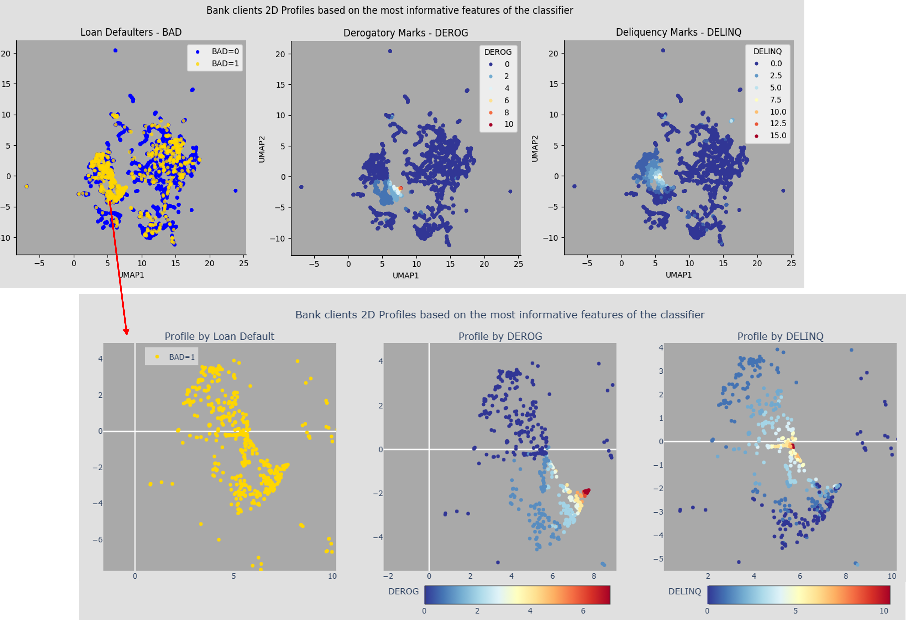

# MIT-Applied-Data-Science-Program-Leveraging-AI-for-Effective-Decision-Making
MIT Professional Education's Applied Data Science Program: Leveraging AI for Effective Decision-Making curriculum is designed by MIT faculty to equip you with the necessary skills, knowledge, and confidence to excel in the industry. It covers the technologies, including Machine Learning, Deep Learning, Recommendation Systems, ChatGPT, Applied Data Science with Python, Generative AI, and others. The curriculum ensures that you are well-prepared to contribute to Data Science efforts in any organization.

# Capstone Project - Loan Default Analysis and Prediction 
## Where gene expression profiles and Loan default analysis meet

In this project, I analyzed the loan **loan default kaggle dataset**, and decided to add some new complexity to the analysis. I optimized a random forest based on recall and ROC auc 
metrics (0.82, 0.92), and after feature importance analysis I generated 2D profiles by performing dimension reduction to the dataset using the top 6 features.  
Originally based on gene expression profiles, the loan default 2d profiles are landscapes indicating the effect of each feature to the distribution of the (non-/)defaulter populations.
The aim of this approach is to illustrate hidden associations between features as well as to indicate which combination of feature better represent the trajectory towards defaulting a 
loan. 

### **A profile of bank clients based on delinquency and derogatory marks**
 

 
